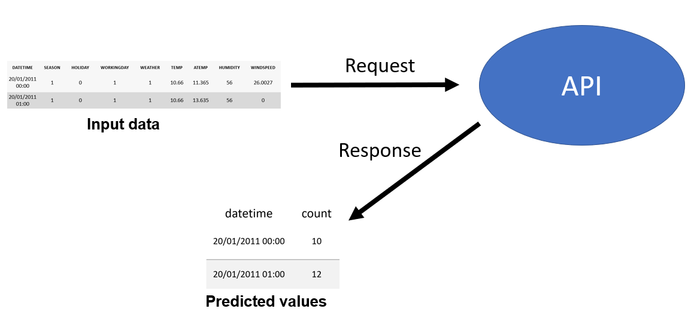
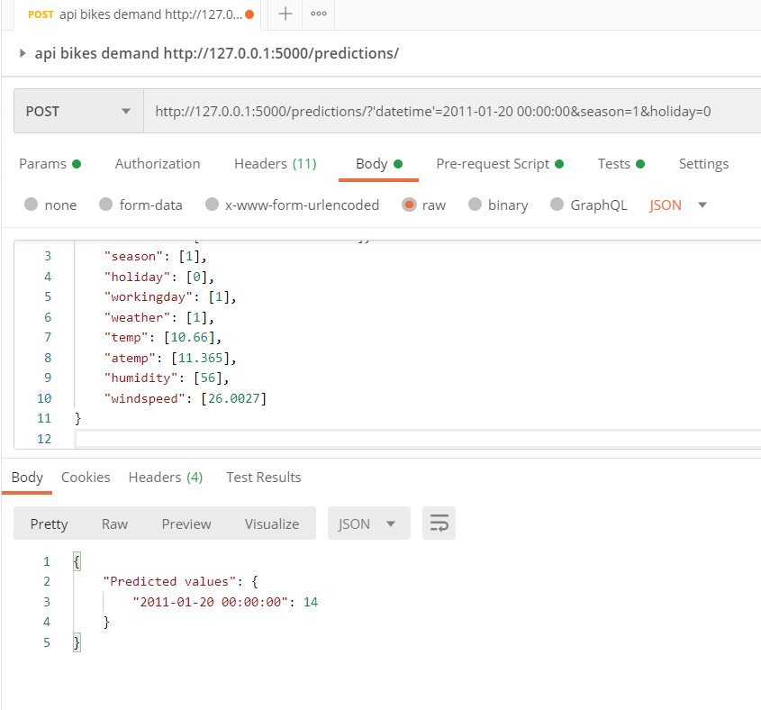

# Bikes rentals API
> This simple Flask API can predict the number of total rentals in the Capital Bikeshare.
The app combines historical usage patterns with weather data in order to forecast bike rental demand in the Capital Bikeshare program in Washington, D.C. 


## About the dataset

Bike sharing systems are a means of renting bicycles where the process of obtaining membership, rental, and bike return is automated via a network of kiosk locations throughout a city. Using these systems, people are able rent a bike from a one location and return it to a different place on an as-needed basis. The data generated by these systems makes them attractive for researchers because the duration of travel, departure location, arrival location, and time elapsed is explicitly recorded. Bike sharing systems therefore function as a sensor network, which can be used for studying mobility in a city. 


The data was downloaded from kaggle.com (<https://www.kaggle.com/c/bike-sharing-demand>)
and it can be found in _data_ directory in the following _csv_ file:
```sh
train.csv
```

## The choice of ML model for the API
In order to predict bike rental demand, the random forest model has been used. In order to properly use training dataset, initial Exploratory Data Analysis(EDA) was carried out.
It allowed to learn more about the dataset and decide what kind of data transformations has to be applied in the features engineering process.
The EDA can be found in the _scripts_ directory in the jupyter notebook file:

```sh
part1_exploratory_data_analyses_Bike_Sharing_Demand.ipynb
```


The EDA phase was followed by the features engineering process in order to improve the performance of machine learning algorithms. Then, 3 machine learning models have been trained in order to choose the optimal one for our application:
1. Linear Regression
2. Random Forest Model
3. GradientBoosting

Finally, the Random Forest has been chosen for this API. The feature engineering process and the training of 3 models are presented in the _scripts_ directory in the following jupyter notebook file:
```sh
part2_training_testing_the_model_Bike_Sharing_Demand.ipynb
```

## About the API
In the figure below, the simple visual description, that explains how does API work, is presented:


## Installation
FYI: The code requires Python 3.8 to run.
```sh
pip install -r requirements.txt
```

## Running API
```sh
python app.py
```

## Running tests
Unit tests are in the _tests_ directory and can be run with pytest python library:
```sh
python -m pytest tests
```

## Building and running Docker
The _Dockerfile_ setup file should be adapted for your configuration.
The default configuration may not work on your computer.
```sh
docker build -t bikes_rentals_API .
```
```sh
docker run bikes_rentals_API -p 5000:5000
```
## Input data
The API returns an array of predictions(_count_ - number of total rentals) given a JSON object representing independent variables. The following input variables have to be introduced:

1. datetime - hourly date + timestamp  
2. season:  
   * 1 = spring,
   * 2 = summer,
   * 3 = fall,
   * 4 = winter 
3. holiday - whether the day is considered a holiday
4. workingday - whether the day is neither a weekend nor holiday
5. weather:
    * 1: Clear, Few clouds, Partly cloudy, Partly cloudy
    * 2: Mist + Cloudy, Mist + Broken clouds, Mist + Few clouds, Mist
    * 3: Light Snow, Light Rain + Thunderstorm + Scattered clouds, Light Rain + Scattered clouds
    * 4: Heavy Rain + Ice Pallets + Thunderstorm + Mist, Snow + Fog 
6. temp - temperature in Celsius
7. atemp - "feels like" temperature in Celsius
8. humidity - relative humidity
9. windspeed - wind speed


## Usage example

In order to see how API works during requesting, we can run request.py module from in the _scripts_ directory in our favourite IDE.
Another way to call the API is to use some form of HTTP client such as Postman. 
We have to send a POST request to the following address:
```sh
http://127.0.0.1:5000/predictions/
```
With a body like this:

```
{
	"datetime": ["2011-01-20 00:00:00"],
	"season": [1],
	"holiday": [0],
	"workingday": [1],
	"weather": [1],
	"temp": [10.66],
	"atemp": [11.365],
	"humidity": [56],
	"windspeed": [26.0027]
}
```

The following result is obtained:
```
{
    "Predicted values": {
        "2011-01-20 00:00:00": 14
    }
}
```


The following result can be obtained in Postman API client:


We can call the API with several data points: 
```
{
	"datetime": ["2011-01-20 20:00:00", "2011-01-20 21:00:00", "2011-01-20 22:00:00", "2011-01-20 23:00:00", "2011-01-21 00:00:00", "2011-01-21 01:00:00"],
	"season": [1, 1, 1, 1, 1, 1],
	"holiday": [0, 0, 0, 0, 0, 0],
	"workingday": [1, 1, 1, 1, 1, 1],
	"weather": [2, 2, 2, 2, 2, 2],
	"temp": [10.66, 9.84, 9.84, 9.84, 9.84, 9.84],
	"atemp": [12.12, 11.365, 10.605, 10.605, 11.365, 11.365],
	"humidity": [60, 60, 65, 65, 70, 70],
	"windspeed": [19.0012, 16.9979, 19.0012, 22.0028, 16.9979, 16.9979]
}
```

The API returns multiple predictions:
```
{
    "Predicted values": {
        "2011-01-20 20:00:00": 114,
        "2011-01-20 21:00:00": 78,
        "2011-01-20 22:00:00": 58,
        "2011-01-20 23:00:00": 42,
        "2011-01-21 00:00:00": 23,
        "2011-01-21 01:00:00": 8
    }
}
```


## Author
Teodor Wisniewski

